

  
 

 

## About the Project

Financial literacy among young individuals is a pressing concern, with one in five teens lacking a basic foundation for financial literacy. PLEARN, our blockchain-based virtual board game, addresses this gap by delivering financial education in an engaging manner. Our aim is to equip the youth with essential financial skills, reduce costs related to financial management, enhance financial safety nets, and ensure financial security. There's a growing divide between the financial responsibilities placed on young individuals and their ability to make informed financial decisions. PLEARN acts as a bridge to close this gap and empower the youth to make wise financial choices. Through PLEARN, players gain hands-on experience in managing finances by investing, trading, and real estate transactions.

<!-- Problems -->
##  Problems

- **Basic knowledge:** 1 in 5 teens lacks a basic foundation to build on for financial literacy.

- **Spending:** Annual wasteful consumption of youth (under 39) is approximately $11.7 billion.

- **Managing:** 74% of teens don’t feel confident about their financial education.

- **Lack of sustainable finance literacy in school.**

- **The gap between the amount of financial responsibility given to the young and their demonstrated ability to manage financial decisions and take advantage of financial opportunities is rapidly widening. Unless significant action is taken to alter this, financial illiteracy will remain an obstacle to Millennials’ financial security, and that is what we are trying to solve through PLEARN.

<!-- Solution -->
## :woman_technologist: Solution

The Edutainment solution we are providing to the market through our game, PLEARN, is a unique and engaging approach to financial education. PLEARN leverages blockchain technology to create a virtual board game that offers players a hands-on experience in managing their finances. It addresses the pressing need for improved financial literacy, especially among the youth.

Through PLEARN, players learn essential financial skills by participating in activities such as investing, trading in both stock and cryptocurrency markets, and purchasing real estate. This immersive experience is designed to make financial education fun and relatable, encouraging players to make informed financial decisions.

By combining entertainment with learning, PLEARN helps users minimize costs associated with financial products, strengthen their financial safety net for emergencies, and ultimately enhance their financial security. Our solution aims to empower individuals to take charge of their financial futures by making their money work for them, a key aspect often overlooked in traditional financial education. PLEARN is a pioneering and interactive tool for building financial literacy and helping individuals achieve financial freedom.

**A Blockchain-based Platform**

**- Integrates:** NFT, real estate, and auction marketplace.

**Gamification**

**- Designs:** optimal UI, interactive, and creative learning activities through gaming in P2E, P2P, socialization modes.

**Built-in Metaverse**

**- Interoperability:** reflecting the real-world activities such as social interactions, lifelike experience, and new opportunities for financial gains.

As the first step of developing the game, we will start with developing the first pillar; the Real Estate.

**Real-Estate Deals Properties**

Contains deals relating to buying (minted) and renting (unminted) virtual lands and properties.

**- Commission to Land/Property Owner**

Land is owned by a landowner if it has been bought. The landowner may choose to hold the property or rent it out, and they may extract a commission, which is deducted automatically. By default, the commission is set to 10% on all Land NFTs and is configurable by the landowner.

**- Modifications to Land NFTs**
   - Ability to ‘name’ land.
   - Ability to sell advertising links on land.
   - Ability to change Land Rating.
   - Ability to rent it out and sell it back.

**- Public Property**
The assets that belong to the game, which help game providers supply the resources and facility to support users to build their network, connect with experts, and reuse knowledge.

**- Private Property**
The assets which users can buy land and build their properties (coffee shops, car producers).

**- Commission to Land/Property Owner**
Land is owned by a landowner if it has been bought. The landowner may choose to hold the property or rent it out, and they may extract a commission, which is deducted automatically. By default, the commission is set to 20% on all Land NFTs and is configurable by the landowner.

<!-- Deployed Dapp URL -->
## :link: Deployed Dapp URL
[PLEARN Dapp](https://plearngame.netlify.app/)

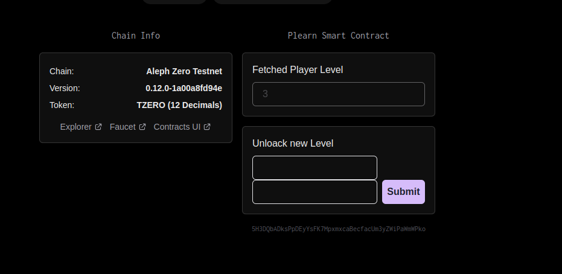
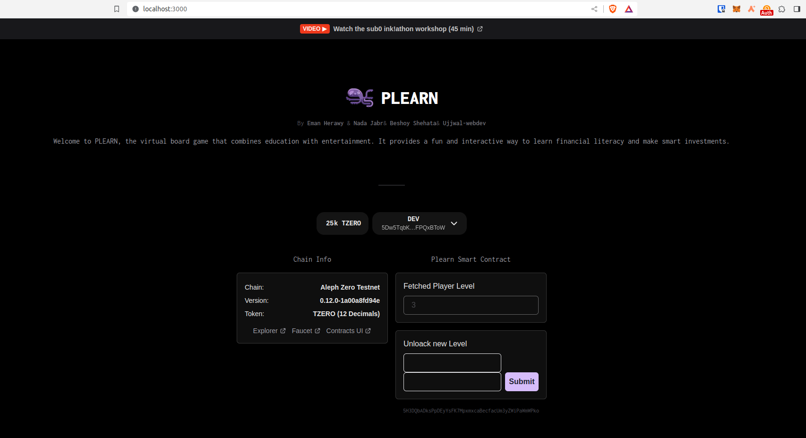
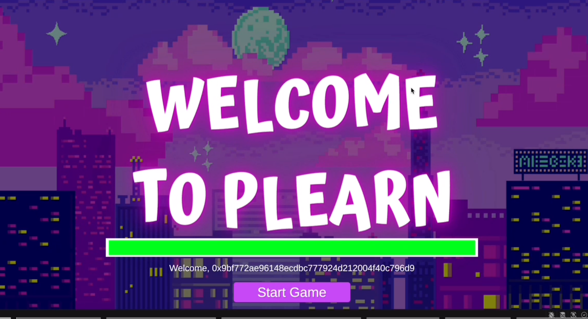
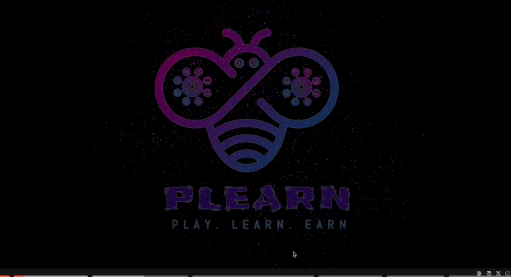
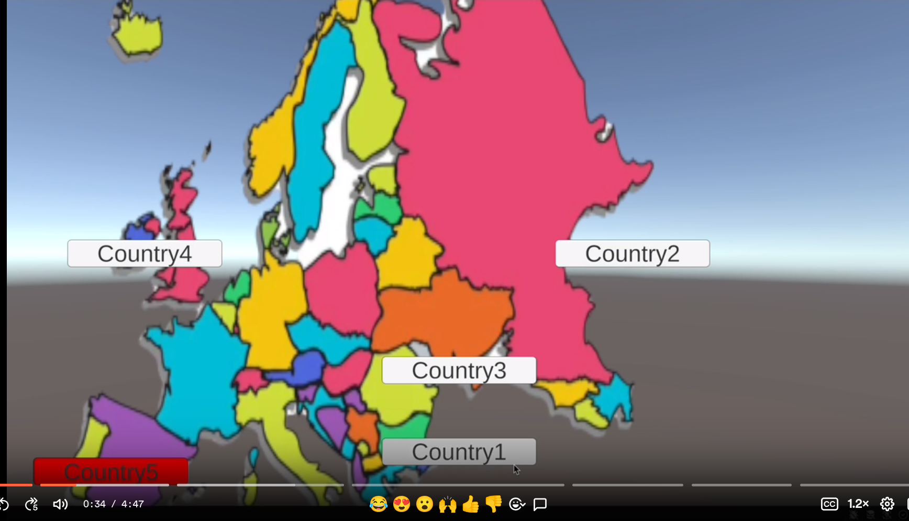
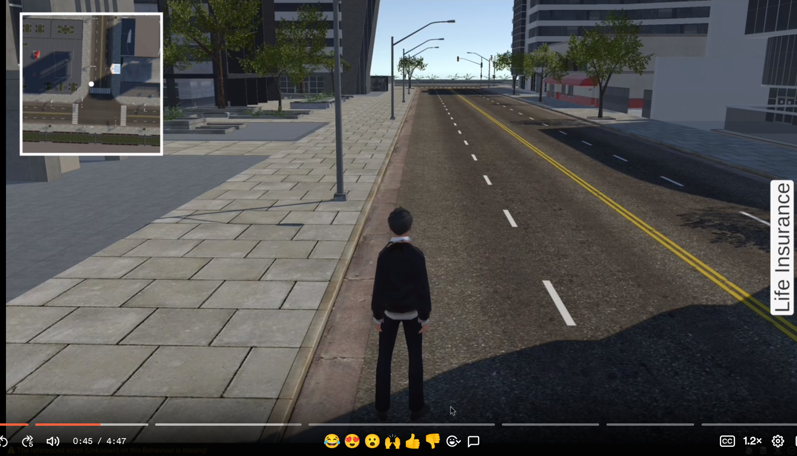
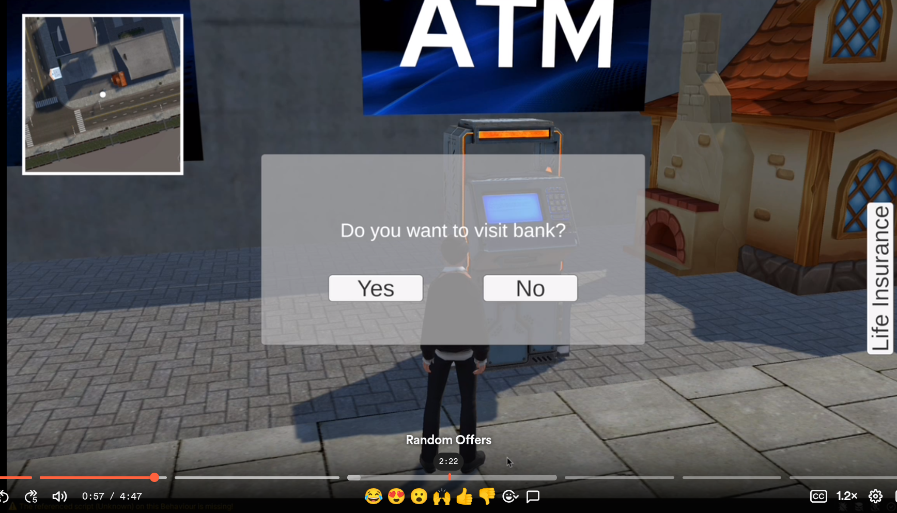
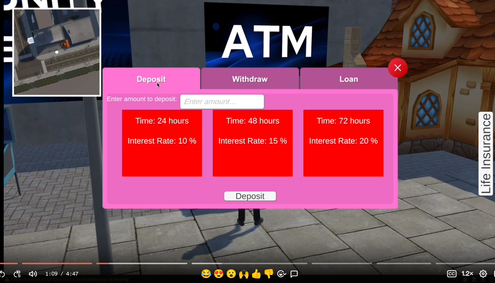
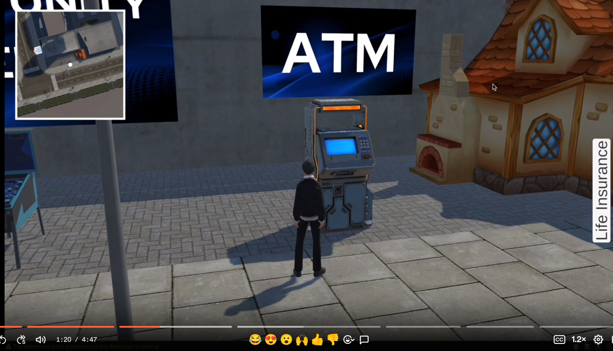
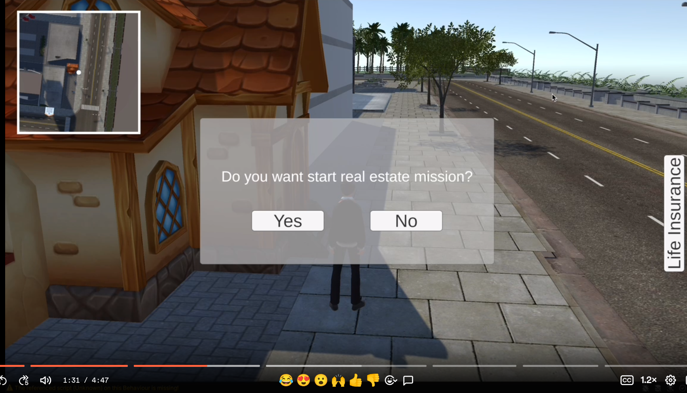
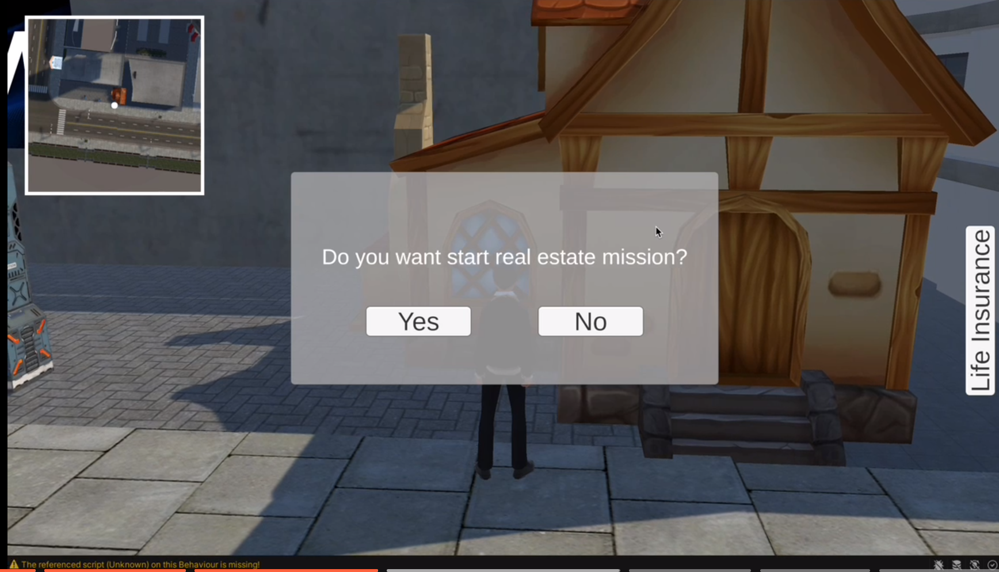

